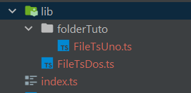

# NX NOTES

## Install nx 

For local install of nx

~~~shell
npm install -D nx
~~~

## Run

For run a specific app

~~~shell
nx serve <name-app>
~~~

## New workspace

~~~shell
npx create-nx-workspace <name-workspace>

# pass @latest in case npx cached an older version of create-nx-workspace
npx create-nx-workspace@latest
~~~

## Add angular app

~~~shell
npm add -D @nrwl/angular
nx g @nrwl/angular:app
~~~

## Add module to app

~~~shell
npx nx generate @schematics/angular:module shared --project=gestion-plan-trabajo-front --no-interactive
~~~

## Add component to app

~~~sh
npx nx generate @schematics/angular:component shared/header --project=gestion-plan-trabajo-front --module=shared --no-interactive
~~~

## Add lib

~~~shell
nx g @nrwl/angular:lib <name-lib>
~~~

Para usar la libreria, el modulo de la libreria se importa en el modulo del proyecto a usar

~~~typescript
import { NgModule } from '@angular/core';
import { BrowserModule } from '@angular/platform-browser';

import { AppComponent } from './app.component';
import { NxWelcomeComponent } from './nx-welcome.component';
//Libreria UI 
//@<workspaceName>/<libName>
import {UiModule} from "@librerias/ui";

@NgModule({
  declarations: [AppComponent, NxWelcomeComponent],
 //Donde se importa el modulo
  imports: [BrowserModule, UiModule],
  providers: [],
  bootstrap: [AppComponent],
})
export class AppModule {}
~~~

### Agregar un componente/servicio a una libreria

~~~sh
# Componente
nx g @nrwl/angular:component button --project ui # <libName>
# Servicio
nx g @nrwl/angular:service sevicio --project ui # <libName>
~~~

### Librerias diferentes

Las librerias se pueden usar para tener logica separada del proyecto principal y no solo componentes o servicios de angular.

Un ejemplo de esto es para usar clases con funcionalidad de fachadas (facade) para los componentes.

Otra puede ser para guardar interfaces, datos o mocks si se da el caso para el proyecto.

Para usar las librerias de esta manera lo primero es crearla con:

~~~shell
nx g @nrwl/angular:lib <libName>
~~~

luego esta libreria se crea con un xxx.module.ts, este archivo se puede eliminar si no se van a utilizar componentes de angular. Si se elimina, en el mismo nivel donde se encuentra la carpeta lib que contenia el archivo se debe actualizar el archivo index, borrando la importanción de dicho archivo.

Para el ejemplo se creara un folder con un archivo ts y un archivo ts suelto y se usara dentro de la app de angular creada.

Luego de tener los archivos creados se debe actualizar el index.ts, quedaria

~~~typescript
export * from './lib/FileTsDos';
export * from './lib/folderTuto/FileTsUno';
~~~

Ahora agregaremos algo de logica a los ts, el 'FileTsUno.ts', exportaremos una interfaz, y dicha interfaz implementada, quedaria asi:

~~~typescript
export interface DatosMock {
  dato1: string,
  dato2: string,
  dato3: string,
}

export const datosIniciales: DatosMock = {
  dato1: "string 1",
  dato2: "string 2",
  dato3: "string 3"
}
~~~

y el 'FileTsDos.ts' quedaria: 

~~~typescript
import {Injectable} from "@angular/core";

@Injectable({
  providedIn: 'root'
})

export class OtroTsDePruena {
  alerta(){
    alert("traido desde la libreria");
  }
}
~~~

Ahora para usar esto en un componente de nuestra app de angular o de alguna libreria del proyecto seria:

* Si es la clase de 'FileTsDos.ts', es necesario inyectarla en el constructor del componente
* Si es los datos o interfaces solo es necesario con la importación

Por ejemplo:

~~~typescript
import { Component, OnInit } from '@angular/core';
import * as lib from '@librerias/tuto'
//Otra forma de importar solo los elementos que se quiere
//import {datosIniciales, DatosMock} from "@librerias/tuto";

@Component({
  selector: 'librerias-button',
  templateUrl: './button.component.html',
  styleUrls: ['./button.component.scss'],
})
export class ButtonComponent implements OnInit{
  //Se usa la interfaz FileTsUno
  atributo?: lib.DatosMock;
  //Se inyecta la clase
  constructor(private prueba: lib.OtroTsDePruena) {}

  ngOnInit(): void {
  //Usando los metodos de la clase traida de las librerias FileTsDos
    this.prueba.alerta();
  //Usando los datos de la lib FileTsUno
    this.atributo = lib.datosIniciales;
      
  }
}
~~~

## Graph

~~~shell
nx dep-graph
~~~

view affected files

~~~shell
nx affected:dep-graph
~~~

## Help

~~~shell
nx g @nrwl/angular:app --help
~~~

